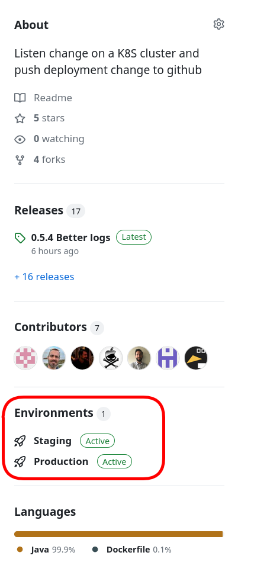
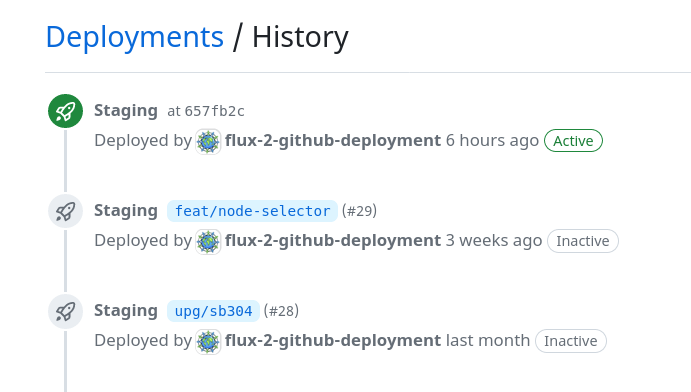
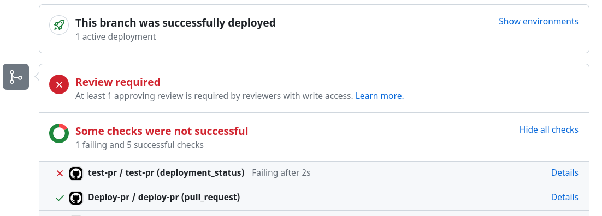

test

# Kubernetes status to GitHub Deployment

This project provides a kubernetes controller to push to GitHub the deployment status of an application deployed in Kubernetes.

##### Table of Contents
- [Why](#why)
  - [Test use case](#test-use-case)
  - [Tracing / delivery metrics use case](#tracing--delivery-metrics-use-case)
- [What it is](#what-it-is)
- [Setup](setup/setup.md)
- [Use the operator](#use-the-operator)
  - [GitHubDeployment kubernetes object](#githubdeployment-kubernetes-object)
  - [Extraction examples](#extraction-examples)

## Why

GitHub can manage deployment and deployment history (deployment event).

For instance, here a list of environments (don't worry, this controller create them automatically)



And on an environment, we can get deployments history with their status:



### Test use case

If a deployment is linked to a PR, it will show on the PR!



You will notice the `test-pr` status to failed. This status is the result of a test triggered when a deployment is successful on the PR! (for instance here, the status would be success only if the curl return a string containing "Hello World")

```yaml
name: test-pr

on:
  deployment_status: {}

jobs:
  test-pr:
    runs-on: [self-hosted, my-runner]
    if: github.event.deployment_status.state == 'success' && startsWith(github.event.deployment_status.environment,'pr-')
    steps:
      - run: |
          DATA=$(curl ${{ github.event.deployment_status.environment_url }})

          [[ $DATA == *"Hello World"* ]]
```

### Tracing / delivery metrics use case

If GitHub contains your deployments, you can trace your version on your environment and extract some metrics.

For instance, if you want to follow [accelerate metrics](https://dora.dev/) you can compute the deployment frequency and using GitHub API, you can find PR / commits between 2 deployments.

## What it is

This controller will capture a status from a kubernetes object (representing your app), and send it to GitHub (in your application repository).

To do so, this controller will periodically check a kubernetes object (usually app/v1 Deployment object) to capture change. A deployment status will be computed -in a slightly modified kstatus way- ie: In progress, Current, Failed, Terminating, Unknown.

Once it is done, if the status has been modified, the controller will send to GitHub a new GitHub deployment status. GitHub will need at least: 
- the repository
- An environment name (can be prod, staging, test, prod-europe, cluster-eu1, ... ) 
- A (static) point in the repository tree to attach the deployment to. This point in the git repository tree can be:
  - A tag   (eg. v0.2.3)
  - A sha1 from a commit (eg. 1234567abc) 

Repository and environment name are static in the configuration, The point in repository tree will be computed from an extraction rule. Usually we simply capture the docker image tag name and extract the data from it. For instance:
- If you use a GitHub release to release your image, you may use a GitHub tag following semver and the same as docker tag. Extraction rule is simply to use the docker tag in this case
- You may want to deploy test image, you may create a tag following a pattern. if so, you'd better set a date/time and the short sha1 of the commit in the tag. An extraction regexp can be used to get the sha1 commit
  - If you follow semver then you can think of a tag pattern like  "1.2.3-date-sha1" (like 0.1.2-202304051523-1234567a) so that you can order the image and also find which commit has produced which image.
  - You can also use a meaningful pattern you prefer like "branchname-date-sha1" (like main-202304051523-1234567a)  or "pr-prnumber-date-sha1" (like pr-5-202304051523-1234567a)

## Setup 

Global setup description is available [setup/setup.md](setup/setup.md)

## Use the operator

### GitHubDeployment kubernetes object

Now you installed the controller, you will be able to use it.

You can create a `GitHubDeployment` object for each application you want to track status change.

Warning: Once a status is Current (OK) for Failed(KO) the status on GitHub will not take a new value for this deployment. 

This tool is not intended to be used as a monitoring system! Focus is only set on deployment phase.

The `GitHubDeployment` is split in 3 pieces:
- What is the kubernetes to observe (`sourceRef`)
- How to extract the Git tree position (the commit sha1, a tag ...)  (`extract`)
- Where to send the deployment event (`repository`)

```yaml
apiVersion: github.decathlon.com/v1beta1
kind: GitHubDeployment
metadata:
  name: example
spec:
  sourceRef:
    apiVersion: apps/v1
    kind: Deployment
    name: podinfo-primary
    namespace: test
  extract:  # Extract the ref on which to GitHub will create the deployment ( commit sha1, tag, etc... )
    containerName: podinfod  #  get the tag of the image of this container. If it is not set, a `jsonPath` option has to be given.
    # jsonPath: $.metadata.annotations.source-ref # a jsonPath to extract a value. Mandatory is `containerName` is not set  
    regexp: main-.*-(.*) # optional. If present, extract a substring from the tag. Capture a single group (can be named "ref")
    # template: "{}"  # optional. If present, use this template to build the GitHub ref from the extracted string. "{}" will be replaced by the extract string. 
                      # For instance if you capture "1.2.3", a template like 'tag-{}' will send to GitHub a ref "tag-123"  
  repository:
    name: my-repo  # your repo name (no need to set the org/user, you can just set the repo name)
    environment: staging # the environment name. It can be anything like  production, staging, ...
```

If the sourceRef is supported - if the controller service account can read the source kubernetes object - (only Deployment and statefulset in the example), then a GitHub deployment will be created on every change. 

The deployment will reference the `ref` extracted from the extract part, thanks to the regexp if provided.

### Extraction examples

#### Simple get tag from a container image tag

if you have a deployment with a container image with a tag : 

```yaml
  spec:
    template:
      spec:
        containers:
          - name: podinfo
            image: podinfo:v1.2.3 
```

then when you use the extract part:

```yaml
    extract:
      containerName: podinfo
```

A GitHub deployment will be created on the "v1.2.3" git tag (if it exists).

#### Get a part from a container image tag

if you have a deployment with a container image with a tag :

```yaml
  spec:
    template:
      spec:
        containers:
          - name: podinfo
            image: podinfo:main-123456789 
```

then when you use the extract part:

```yaml
    extract:
      containerName: podinfo
      regexp: main-(.*)
```

A GitHub deployment will be created on the commit referenced by "123456789" (a sha1 in the repo).

#### Use a template to create the ref

if you have a deployment with a container image with a tag :

```yaml
  spec:
    template:
      spec:
        containers:
          - name: podinfo
            image: podinfo:main-1.2.3 
```

then when you use the extract part:

```yaml
    extract:
      containerName: podinfo
      regexp: main-(.*)
      template: "RELEASE-{}"
```

A GitHub deployment will be created on the "RELEASE-1.2.3" git tag (if it exists).

#### Extract from an annotation

if you have a deployment with an annotation :

```yaml
  metadata:
    annotations:
      source-ref: 123456789
```

then when you use the extract part:

```yaml
    extract:
      jsonPath: $.metadata.annotations.source-ref
      regexp: (.*)
```

A GitHub deployment will be created on the commit referenced by "123456789". 
