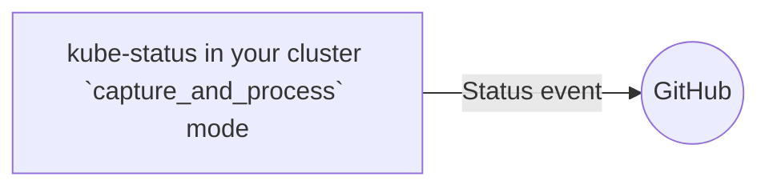
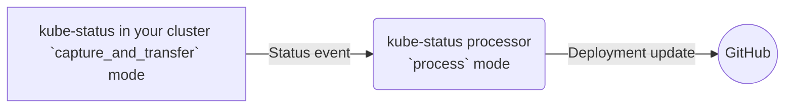

- [Setup](#setup)
    - [Controller mode](#controller-mode)
    - [Kubernetes role](#kubernetes-role)
    - [Configuration file](#configuration-file)
    - [Corporate proxy](#corporate-proxy)
    - [Kube deployment](#kube-deployment)
- [Deployment example](#deployment-example)

## Setup

The controller is available as a docker image here: decathlon/status-to-deployment:1.2.3.
Using the latest version is recommended.
But before launching the controller, it is important to understand how to configure it:

### Controller mode

This controller will connect to GitHub through a GitHub app. Doing so may be painful to deploy if you have a lot of clusters. In such case, we can also make this controller work in 2 part: a capture part (check the Kubernetes cluster) which call a transfer part (will send data to GItHub). You will need an OAuth2 identity provider to authenticate the

A small diagram to explain better:

With a single cluster, you can use a `capture and push` mode:



If you have multiple cluster, configuring the GitHub access may be complex. If you have an OAuth2 identity provider, it may be much easier to generate an identity (client_credential) one per cluster and transfer to GitHub via a single transfer node:



In simple text, here is the possible mode this controller can take:

- `capture_and_process`: Check status on the local kubernetes and push event to GitHub.
- `process`: Receive event from another instance via http (protected by an oauth2 token) and push the event to GitHub
- `capture_and_transfer`: Check status on the local kubernetes cluster and push event via the transfer API to a process node

### Kubernetes role

On `capture_and_process` and `capture_and_transfer` mode, the controller need to access Kubernetes API to do some processing. The basic role need to have:

- Full access to githubdeployments and githubdeployments/status object
- Permission to create event
- Read/Write access to the coordination.k8s.io/leases resource to prevent duplicate controller running.
- Need to READ (read/list/watch) **every** resource you want to track. The default file provided will only track the `Deployment` resources.

> :warning: **If you want to track other kubernetes object than Deployment, you have to add the read access to this object in the role!**

And example of such role is shown here:

```yaml
kind: ClusterRole
apiVersion: rbac.authorization.k8s.io/v1
metadata:
  name: kube-to-status-role
rules:
  - apiGroups:
      - github.decathlon.com
    resources:
      - githubdeployments
      - githubdeployments/status
    verbs:
      - get
      - list
      - watch
      - create
      - update
      - patch
      - delete
  - apiGroups: [""]
    resources: ["events"]
    verbs: ["create"]
  - apiGroups:
      - coordination.k8s.io
    resources:
      - leases
    verbs:
      - get
      - create
      - update
      - patch
      - delete
  # Add here the resources you want to check. Usually deployments and statefulsets, but you could add helmreleases, jobs ...
  - apiGroups:
      - apps
    resources:
      - deployments
      - statefulsets
    verbs:
      - get
      - list
      - watch
```

### Configuration file

The controller can be parametrized via a simple configuration file named `application.yaml` (note: properties file is also supported)

In this file, if a value is like `$VALUE` it means the value will be based from the environment variable `VALUE`.

The default configuration file look like the one below, so you usually do not need to create one, as you can drive the configuration via environment variable.

If you choose to set a configuration file, you will need to set it in the `config/` subdirectory from the application binary (in the docker image, in `/workspace/config` for instance )

the file look like:

```yaml
app:
  mode: ${APP_MODE:capture_and_transfer} # can be `capture_and_process`, `process` or `capture_and_transfer` (default)

  transfer:  # if the mode is `capture_and_transfer` this entry is mandatory. Define where to transfer the captured event and which oauth registration (client_credential) to use (defined later in this file)
    host: ${TRANSFER_HOST:https://my.collector.corp:8080/processor}
    oauth-registration: fedid

  github: # Define how we interact with GitHub. We have to use a GitHub app or a PAT. You will need Read and Write access to `Deployments`.
    app: # GitHub app definition. Mandatory if token not given
      id: ${GITHUB_APP_ID:0}
      private-key: ${GITHUB_APP_PRIVATE_KEY:}
    orgs: ${GITHUB_ORG:myorg}
    github-api: ${GITHUB_API:https://api.github.com}
    token: ${GITHUB_TOKEN:} # A PAT. Mandatory if app not given
    
  kubernetes: # only for `capture_and_process` and `capture_and_transfer` mode. 
    refresh: 60s # Will check new status every this much time

spring:  # basic security configuration
  security:
    oauth2:
      client:  # only for `capture_and_transfer` mode. It defines an OAuth2 client_credential configuration to connect to the transfer node. 
        provider:
          fedid: # your oauth2 provider name 
            token-uri: ${OAUTH_TOKEN_URI:https://oauth.corporate.com/token.oauth2}  # You oauth2 token endpoint
        registration:
          fedid: # A registration name. This registration is used in the transfer block above.
            provider: fedid # name of your oauth2 provider declared just before
            authorization-grant-type: client_credentials
            client-id: ${OAUTH_CLIENT_ID:0}
            client-secret: ${OAUTH_CLIENT_SECRET:}

      resourceserver: # only for `process` mode. This configuration is needed to validate request to the transfer endpoint.
        jwt:
          jwk-set-uri: ${OAUTH_JWKS_URI:https://oauth.corporate.com/JWKS}
          issuer-uri: ${OAUTH_ISSUER_URI:https://corporate.com}
```

| Env variable           | Default                | Description                                                                                                                                                                                               | 
|------------------------|------------------------|-----------------------------------------------------------------------------------------------------------------------------------------------------------------------------------------------------------|
| APP_NAMESPACE          |                        | MANDATORY if using the controller on Kubernetes. The namespace the controller is deployed on. It is usually linked to the downward API: `metadata.namespace`                                              |
| APP_MODE               | capture_and_transfer   | The mode can be `capture_and_process`, `process` or `capture_and_transfer`                                                                                                                                |
| TRANSFER_HOST          |                        | Only if the mode is `capture_and_transfer`. Define where to transfer the captured event                                                                                                                   |
| GITHUB_ORG             |                        | only for `capture_and_process` or `capture_and_transfer`. The GitHub organization to interact with                                                                                                        |
| GITHUB_API             | https://api.github.com | only for `capture_and_process` or `capture_and_transfer`. The GitHub api endpoint to interact with                                                                                                        |
| GITHUB_APP_ID          |                        | only for `capture_and_process` or `capture_and_transfer`. If you use a GitHub app to interact with GitHub, the id of this app                                                                             |
| GITHUB_APP_PRIVATE_KEY |                        | only for `capture_and_process` or `capture_and_transfer`. If you use a GitHub app to interact with GitHub, the private key of this app                                                                    |
| GITHUB_TOKEN           |                        | only for `capture_and_process` or `capture_and_transfer`. A GitHub PAT. Mandatory if app is not given. If given and an app is configured, this token takes priority                                       |
| OAUTH_TOKEN_URI        |                        | only for `capture_and_transfer` mode. OAuth2 token uri called to get an access token to call the transfer api                                                                                             |
| OAUTH_CLIENT_ID        |                        | only for `capture_and_transfer` mode. OAuth2 client id to get a token to call the transfer api (client_credential mode)                                                                                   |
| OAUTH_CLIENT_SECRET    |                        | only for `capture_and_transfer` mode. OAuth2 client secret to get a token to call the transfer api (client_credential mode)                                                                               |
| OAUTH_JWKS_URI         |                        | Only for `process` mode. The JWKS endpoint of your OAuth2 provider. A call to the transfer endpoint will be validated from the signature of the access_token against public key provided by this endpoint |
| OAUTH_ISSUER_URI       |                        | Only for `process` mode. The issuer uri you want to validate. A call to the transfer endpoint will be validated from the access_token issuer against this value                                           |

### Corporate proxy

If you are behind a corporate proxy, you will need to add a docker command (a Kubernetes args) like:

```yaml
          args:
            - -Dhttps.proxyHost=proxy.corporate.com
            - -Dhttps.proxyPort=3128
            - -Dhttp.nonProxyHosts=172.20.0.1|kubernetes|kubernetes.default.svc.cluster.local
```

### Endpoint security

The container will lister on port 8080. There are few endpoint available:

| Endpoint | Description                                                                   |
|----------|-------------------------------------------------------------------------------|
| /actuator/health | Health check endpoint                                                         |
| /transfer | The endpoint to transfer the captured event. Only available in `process` mode |

Security wise, you should only permit access from outside to `/transfer` endpoint. The other endpoint are for internal purpose.

### Kube deployment

Overall, the deployment of this controller will need:

- Declare a Kubernetes service account
- Construct a role for this controller and bind it to the service account [Kubernetes role](#kubernetes-role)
- Inject the CRD [available here](crds/githubdeployments.yaml)
- Deploy the controller via the deployment like the one bellow

```yaml
apiVersion: apps/v1
kind: Deployment
metadata:
  labels:
    app: kube-to-status
  name: kube-to-status
  namespace: tooling
spec:
  replicas: 1
  selector:
    matchLabels:
      app: kube-to-status
  template:
    metadata:
      labels:
        app: kube-to-status
    spec:
      containers:
      - env:
        - name: APP_NAMESPACE
          valueFrom:
            fieldRef:
              apiVersion: v1
              fieldPath: metadata.namespace
        envFrom:
        - secretRef:
            name: kube-to-status
        image: decathlon/status-to-deployment:1.2.3
        livenessProbe:
          failureThreshold: 3
          httpGet:
            path: /actuator/health
            port: 8080
            scheme: HTTP
          periodSeconds: 10
          successThreshold: 1
          timeoutSeconds: 1
        name: kubernetes-status
        ports:
        - containerPort: 8080
          protocol: TCP
        readinessProbe:
          failureThreshold: 3
          httpGet:
            path: /actuator/health
            port: 8080
            scheme: HTTP
          periodSeconds: 10
          successThreshold: 1
          timeoutSeconds: 1
        resources:
          limits:
            cpu: 100m
            memory: 200Mi
          requests:
            cpu: 100m
            memory: 200Mi
        volumeMounts:
        - mountPath: /workspace/config
          name: kube-to-status
      serviceAccountName: kube-to-status
      volumes:
      - configMap:
          defaultMode: 420
          name: kube-to-status
        name: kube-to-status
```

## Deployment example

[Simple capture deployment](capture/step-by-step.md)

[process only](process/readme.md)
